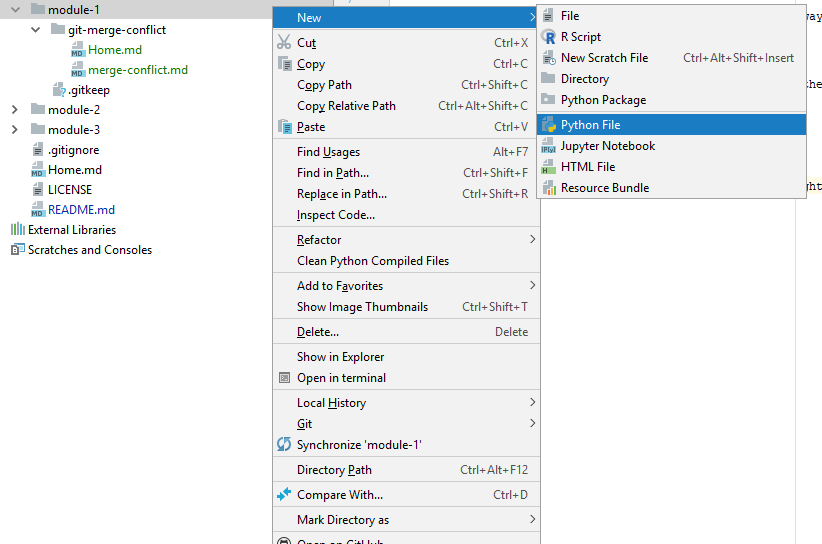

# Guided Lesson - Resolving Merge Conflicts in Git

## Introduction
When working collaboratively, sometimes we tend to step on each other's toes. What this means is that sometimes we and other developers happen to edit the same code at the same time. While we might try to keep our changes isolated with branching, this does not prevent editing the same lines of code by two different people.

It is crucial that we learn how to resolve these conflicts as simply as possible. This is because the thing that scares away developers from Git the most is merge conflicts. We would like you to have strong Git Fu so we think you should tackle this problem head on. Let's start by setting up a merge conflict and then resolving it.

## Creating a Merge Conflict

In order to create a merge conflict, we will create a Python file in PyCharm, create a new branch and change the code in the file. We will then change the code in the main branch and then proceed to merge the new branch with the main branch.

### Adding a file to the repo

We open PyCharm and open the `data-labs` folder.

In our `data-labs` repo, we will add a python file to this current module (module 1) and name the file `git-fu.py`. We right click the `module-1` folder and select Python file.

 

When PyCharm prompts you to add the file to Git, make sure to choose yes. You can also add it manually by typing this in the terminal:

```
git add .
```

We will add one line of code to the file for the sake of simplicity. The file contains only this line of code:

```
print("this is the original message")
```

Now we commit and push the repository using the following commands:

```
$ git commit -am "adding git-fu file"
$ git push
Enumerating objects: 18, done.
Counting objects: 100% (17/17), done.
Delta compression using up to 8 threads.
Compressing objects: 100% (10/10), done.
Writing objects: 100% (12/12), 31.53 KiB | 10.51 MiB/s, done.
Total 12 (delta 3), reused 0 (delta 0)
remote: Resolving deltas: 100% (3/3), completed with 2 local objects.
To https://github.com/ironhack/data-labs.git
   7f7f613..8b37c4f  master -> master
```

Now we will create a new branch and switch to this branch. We do this using the following command:

```
$ git checkout -b conflict
```

We can also create a new branch in the git menu on the bottom right in PyCharm.


In the conflict branch we now alter the line of code in the `git-fu.py` file to this:

```
print("this is the altered message")
```

We now commit and push this change:

```
$ git commit -am "altering git-fu file"
$ git push
```